# Testing para NestJs con Jest y Supertest

# Temario 📌

- 1 [Introducción](#1-introducción)

- 2 [Introducción al testing con la Kata Fizz Buzz](#2-introducción-al-testing-con-la-kata-fizz-buzz)

  - 2.1 [Pruebas en NestJS](#2-1-Pruebas-en-NestJS)
  - 2.2 [El archivo de tests app.controller.spec.ts](#2-2-el-archivo-de-tests-appcontrollerspect)
    - 2.2.1 [La función it](#2-2-1-la-función-it)
    - 2.2.2 [Agrupación de tests mediante describe](#2-2-2-agrupación-de-tests-mediante-describe)
    - 2.2.3 [La función beforeEach](#2-2-3-la-función-beforeeach)
  - 2.3 [Implementación de la kata Fizz Buzz](#2-3-implementación-de-la-kata-fizz-buzz)
  - 2.4 [Pruebas unitarias del servicio](#2-4-pruebas-unitarias-del-servicio)
  - 2.5 [Cobertura de tests](#2-5-cobertura-de-tests)
    - 2.5.1 [Exclusión de archivos de la cobertura de tests](#2-5-1-exclusión-de-archivos-de-la-cobertura-de-tests)
  - 2.6 [Pruebas unitarias del controlador](#2-6-pruebas-unitarias-del-controlador)
    - 2.6.1 [Mockeo mediante jest.spyOn](#2-6-1-mockeo-mediante-jestspyon)
    - 2.6.2 [Mockeado del servicio completo](#2-6-2-mockeado-del-servicio-completo)
  - 2.7 [Pruebas de integración](#2-7-pruebas-de-integración)

- 3 [Caso de uso. Reserva de espacios](#3-caso-de-uso-reserva-de-espacios)

  - 3.1 [Primeros tests](#3-1-primeros-tests)
  - 3.2 [Tests del controlador de solicitudes](#3-2-tests-del-controlador-de-solicitudes)
    - 3.2.1 [Primer paso. Evitar que falle el test](#3-2-1-primer-paso-evitar-que-falle-el-test)
    - 3.2.2 [Segundo paso. Añadir tests](#3-2-2-segundo-paso-añadir-tests)
    - 3.2.3 [Tercer paso. Llevar el mock del servicio a una clase](#3-2-3-tercer-paso-llevar-el-mock-del-servicio-a-una-clase)
  - 3.3 [Tests del servicio](#3-3-tests-del-servicio)
    - 3.3.1 [Primer paso. Evitar que falle el test](#3-3-1-primer-paso-evitar-que-falle-el-test)
    - 3.3.2 [Segundo paso. Añadir tests](#3-3-2-segundo-paso-añadir-tests)
    - 3.3.3 [Tercer paso. Llevar el mock del repositorio a una clase](#3-3-3-tercer-paso-llevar-el-mock-del-repositorio-a-una-clase)
  - 3.4 [Tests end to end](#3-4-tests-end-to-end)
    - 3.4.1 [Añadir script para tests e2e en modo watch](#3-4-1-añadir-script-para-tests-e2e-en-modo-watch)
    - 3.4.2 [Primer paso. Evitar que falle el test](#3-4-2-primer-paso-evitar-que-falle-el-test)
    - 3.4.3 [Segundo paso. Añadir tests](#3-4-3-segundo-paso-añadir-tests)
    - 3.4.4 [Tercer paso. Llevar el mock del repositorio a una clase](#3-4-4-tercer-paso-llevar-el-mock-del-repositorio-a-una-clase)
  - 3.5 [Cobertura de tests](#3-5-cobertura-de-tests)
  - 3.6 [Creación del resto de tests](#3-6-creación-del-resto-de-tests)

- Anexo I [Plugin Coverage Gutters](#anexo-i-plugin-coverage-gutters)

## 1. [Introducción](#temario-📌)

El testing es esencial en cualquier proyecto de software serio, ya que proporciona confianza en la aplicación y previene errores al modificar o extender el código. Automatizar las pruebas ofrece un feedback continuo y evita procesos tediosos y propensos a errores humanos. Además, permite la reproducción de casos complejos y su integración en sistemas de CI/CD para despliegues automáticos. La pirámide de tests es una herramienta para comprender los diferentes niveles de pruebas: unitarias, que verifican partes específicas del código; de integración, que evalúan la interacción entre varias aplicaciones; y end-to-end, que simulan condiciones reales de uso.


**Tests unitarios:** Son código que ayuda a asegurar que las partes de las aplicaciones funcionan de la forma esperada. La unidad testeada puede ser una función, una clase, un módulo. Deben ser independientes unos de otros. Para una entrada, el test unitario comprueba el resultado. No contactan con el mundo exterior

**Tests de integración:** Aquí comprobamos la integración de los controladores con los servicios, la integración de nuestro sistema con algo de infraestructura (p.e. bases de datos, archivos, E/S, …​). Este tipo de tests pueden hacer llamadas a servicios externos. Las pruebas de integración normalmente cubren la prueba de un sistema (p.e. backend) aislándolo del resto.

**Tests end to end:** También conocidas como pruebas funcionales, simulan condiciones reales. Se ejecutarían en un navegador (o similar) y cubren todos los sistemas funcionando juntos (p.e. frontend y backend). Simulan a un usuario en la aplicación (escribiendo, haciendo clics, …​)

> **Jest** para tests unitarios en backend (pruebas de objetos de dominio, controladores y servicios) así como en frontend.

> **Supertest** para tests de integración en backend y frontend. Permite hacer las pruebas de llamadas HTTP.

> **Cypress** para pruebas e2e que simulen las acciones de los usuarios. Implican todo el sistema se ve involucrado el navegador y la interfaz

> NOTA: El código de los tests tiene que ser fácil de mantener y tiene que centrarse en el resultado del método probado. Después de crear un test nos debemos preguntar lo siguiente: si un día se refactoriza el método probado (sin cambiar su resultado), ¿tendré que cambiar el test? Si la respuesta es sí, hay que modificar el test. Posiblemente en el test nos estemos centrando en detalles del proceso que no deberían de estar en el test.

## 2. [Introducción al testing con la kata Fizz Buzz](#temario-📌)

Para introducirnos al mundo de testing lo haremos de la mano de la kata Fizz Buzz. Se trata de un ejemplo sencillo en que para números comprendidos entre 1 y 100:

Se devolverá Fizz si el número es múltiplo de 3.

Se devolverá Buzz si es múltiplo de 5.

Se devolverá Fizzbuzz si es múltiplo de 15.

En cualquier otro caso, se devolverá el propio número.

Comencemos creando el proyecto NestJS.

```bash
nest new fizzbuzz
```

Al crear un proyecto nuevo, NestJS instala las dependencias para testing y crea una suite de pruebas con un test de ejemplo para probar que la llamada a / devuelve Hello World!.

Comenzamos probando el código de ejemplo creado por NestJS.

```bash
cd fizzbuzz
npm run test
```

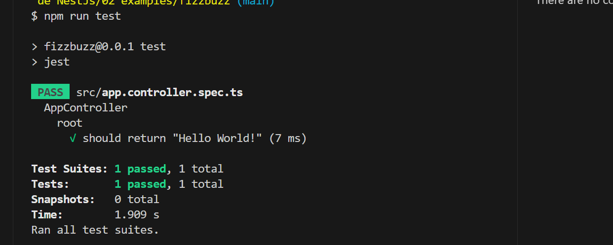

### 2. 1. [Pruebas en NestJS](#temario-📌)

Como acabamos de comentar, el CLI de NestJS instala las dependencias de testing y crea una suite de pruebas a modo de ejemplo al crear un proyecto nuevo. Y es que NestJS ayuda a que el proceso sea menos tedioso ofreciendo lo siguiente:

Realiza un scaffolding para tests en la aplicación. Cuando creamos controladores y servicios, el CLI de NestJS también crea su correspondiente archivo de testing para dichos controladores y servicios. Al crear el proyecto, el CLI de NestJS también crea un archivo de testing e2e para probar la llamada a la ruta raíz de la aplicación.

Integracion con Jest (desarrollado por Facebook y se usa con "cero configuración") y Supertest (para testing de peticiones HTTP). No obstante, se puede usar cualquier otro framework de testing.

Uso del sistema de inyección de dependencias de NestJS para facilitar el uso de mocks. Por ejemplo, esto nos va a poder permitir proporcionar un servicio mockeado al probar un controlador.

Jest se configura a través del archivo package.json determinando mediante expresiones regulares los archivos que se consideran tests (p.e. para que las pruebas estuviesen en cualquier archivo .spec.ts usaríamos

```textplain
"testRegex": ".*\\.spec\\.ts$").
```

### 2. 2. [El archivo de tests app.controller.spec.ts](#temario-📌)

El archivo de pruebas tiene el siguiente aspecto

```typescript
import { Test, TestingModule } from '@nestjs/testing'
import { AppController } from './app.controller'
import { AppService } from './app.service'

describe('AppController', () => {
  let appController: AppController

  beforeEach(async () => {
    const app: TestingModule = await Test.createTestingModule({
      // fíjate en la similitud con TestBed de angular
      controllers: [AppController],
      providers: [AppService],
    }).compile()

    appController = app.get<AppController>(AppController)
  })

  describe('root', () => {
    it('should return "Hello World!"', () => {
      expect(appController.getHello()).toBe('Hello World!')
    })
  })
})
```

#### 2. 2. 1. [La función it](#temario-📌)

En Jest, los tests se implementan mediante funciones it (realmente, it es un alias de una función denominada test, y se pueden usar de forma indistinta). La función it toma 3 argumentos:

Nombre del test

Función con las expectativas

Timeout (opcional). El timeout predeterminado es de 5 segundos.

```typescript
it(// 1
'should return "Hello World!"', () => {
  // 2
  // 3
  expect(appController.getHello()).toBe('Hello World!') // 4
})
```

1. Definición del caso de prueba
2. Nombre del caso de prueba
3. Función de evaluación del test con la definición de las expectativas
4. expect se usa para comprobar un valor obtenido por una función matcher, como toBe.

> Nota: El usar it en lugar de test, sumado a usar el nombre del test en condicional, hace que el test sea más legible: it should return "Hello World!

#### 2. 2. 2. [Agrupación de tests mediante describe](#temario-📌)

Para tener un código de testing más limpio y organizado, los tests (it) se pueden incluir en una función describe. Esto da lugar a un código de testing agrupado en bloques describe, los cuales están formados por tests it. Además, los bloques describe se pueden anidar. A continuación se muestra una estructura de agrupación de tests en bloques describe.

```typescript
  describe('root', () => { // 1
    it('should return "Hello World!"', () => { // 2
      expect(appController.getHello()).toBe('Hello World!');
    });

    it('should ....' () => { // 3
      // test code
    });
  });
```

1. describe como agregador de tests
2. Primer test del bloque
3. Un segundo test del bloque

#### 2. 2. 3. [La función beforeEach](#temario-📌)

La función beforeEach se ejecuta antes de que se ejecute cada test de la suite. Normalmente prepara una configuración que los tests necesitan para ejecutarse de forma independiente al resto de tests (p.e. prepara el contenido de la base de datos, configura un servicio para que devuelva unos datos concretos a los tests, …​)

Esta función forma parte del conjunto de funciones de preparación o limpieza del entorno de testing:

beforeAll se ejecuta una sola vez antes de todos los tests del bloque.

beforeEach se ejecuta antes de cada test del bloque.

afterEach se ejecuta después de cada test del bloque.

afterAll se ejecuta una sola vez después de todos los tests del bloque.

### 2. 3. [Implementación de la kata Fizz Buzz](#temario-📌)

Comenzamos creando un nuevo módulo, un servicio y un controlador para la kata.

```bash
nest g module fizzbuzz
nest g service fizzbuzz
nest g controller fizzbuzz
```

En el servicio fizzbuzz/fizzbuzz.service.ts crearemos un nuevo método denominado fizzbuzz que aceptará un argumento de tipo number. El servicio tiene la lógica siguiente para implementar la kata Fizz Buzz.

```typescript
import { Injectable } from '@nestjs/common'

@Injectable()
export class FizzbuzzService {
  fizzbuzz(number): any {
    if (number < 1 || number > 100) {
      return
    }

    if (number % 15 === 0) {
      return 'FizzBuzz'
    }

    if (number % 3 === 0) {
      return 'Fizz'
    }

    if (number % 5 === 0) {
      return 'Buzz'
    }

    return number
  }
}
```

Para el controlador fizzbuzz/fizzbuzz.controller.ts crearemos un endpoint que acepte un número como parámetro. Este endpoint llamará al método del servicio del paso anterior.

```typescript
import { Controller, Get, Param } from '@nestjs/common'
import { FizzbuzzService } from './fizzbuzz.service'

@Controller('fizzbuzz')
export class FizzbuzzController {
  constructor(private fizzbuzzService: FizzbuzzService) {}

  @Get(':number')
  fizzbuzz(@Param('number') number): any {
    return this.fizzbuzzService.fizzbuzz(number)
  }
}
```

Ahora podríamos probar la aKata porcualquier número

Ahora podemos probar la kata con cualuier número:

- http://localhost:3000/fizzbuzz/3 devolvería Fizz

- http://localhost:3000/fizzbuzz/5 devolvería Buzz

- http://localhost:3000/fizzbuzz/15 devolvería FizzBuzz

- http://localhost:3000/fizzbuzz/2 devolvería 2

### 2. 4. [Pruebas unitarias del servicio](#temario-📌)

El CLI de NestJS ha creado el archivo fizzbuzz/fizzbuzz.service.spec.ts para los tests del servicio generado. Los tests los añadiremos en el grupo describe existente. Se trata de definir los casos de prueba para los casos de testing de la kata (3, 5, 15, ninguno de ellos, fuera del rango 1-100)

```typescript
import { Test, TestingModule } from '@nestjs/testing'
import { FizzbuzzService } from './fizzbuzz.service'

describe('FizzbuzzService', () => {
  // 1
  let service: FizzbuzzService

  beforeEach(async () => {
    const module: TestingModule = await Test.createTestingModule({
      providers: [FizzbuzzService],
    }).compile()

    service = module.get<FizzbuzzService>(FizzbuzzService)
  })

  it('should be defined', () => {
    // 2
    expect(service).toBeDefined()
  })

  it('should return Fizz when the number is multiple of 3', () => {
    // 3
    expect(service.fizzbuzz(3)).toBe('Fizz') // 4
  })

  it('should return Buzz when the number is multiple of 5', () => {
    expect(service.fizzbuzz(5)).toBe('Buzz')
  })

  it('should return FizzBuzz when the number is multiple of 15', () => {
    expect(service.fizzbuzz(15)).toBe('FizzBuzz')
  })

  it('should return the number when then number is neither multiple of 3, 5 nor 15', () => {
    expect(service.fizzbuzz(2)).toBe(2)
  })

  it('should return nothing when the number is not between 1 and 100', () => {
    // 5
    expect(service.fizzbuzz(0)).toBe(undefined)
    expect(service.fizzbuzz(101)).toBe(undefined)
  })
})
```

- 1 Grupo de tests creados inicialmente por NestJS a modo de ejemplo para el servicio Fizzbuzz
- 2 Test inicial creado por NestJS
- 3 Cada test va en su función it (o test) y contiene un texto (realmente es el nombre del test) que permite entender claramente la intención del test.
- 4 Con expect indicamos lo que queremos probar y con toBe indicamos el valor esperado.
- 5 En este caso, quizá sería más apropiado crear dos tests separados para probar cada uno los de límites del rango no permitido (i.e. un test para comprobar que no se aceptan números menores que 1 y otro test para comprobar que no se aceptan números mayores que 100).

**Los tests pueden hacer 3 cosas:**

- 1 Preparar el entorno (setup).
- 2 Llamar a algo (actuar)
- 3 Verificar el comportamiento (assert o verificar).

Para ejecutar sólo los tests del servicio y no los de todo el proyecto, lanzaremos los tests en modo watch:

```bash
npm run test:watch
# Se nos indicará el modo de uso para que elijamos uno:
Watch Usage
 › Press a to run all tests.
 › Press f to run only failed tests.
 › Press p to filter by a filename regex pattern.
 › Press t to filter by a test name regex pattern.
 › Press q to quit watch mode.
 › Press Enter to trigger a test run.
```

Seleccionamos `p` para indicar el nombre de archivo del servicio. No hace falta introducir el nombre entero. Basta con una parte del nombre que permita seleccionarlo (p.e. fizzbuzz.se)

```bash
pattern: fizzbuzz.ser
```

y se ejecutraía el test indicado

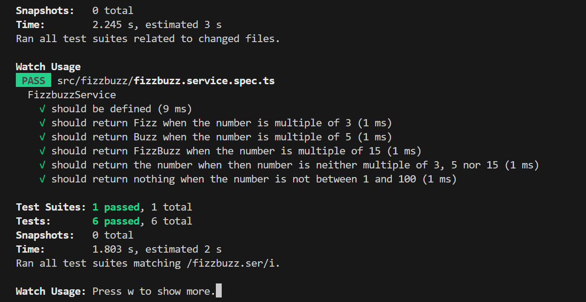

De forma predeterminada, los resultados de ejecución de los tests se muestran de forma agregada si hay varias suites de tests, perdiéndose los datos de cada test individual. En ocasiones, esta información detallada de cada test puede ser útil. Para activarlo, basta con cambiar en package.json la entrada en scripts sustituyendo "test": "jest", por "test": "jest --verbose",.

```json
   "scripts": {
    "test": "jest --verbose",
    "test:watch": "jest --watch",
    "test:cov": "jest --coverage",
```

Así al pasar los tests todo estará más detallado.

### 2. 5. [Cobertura de tests](#temario-📌)

En el proceso de testing la cobertura de tests proporciona una medida muy interesante. Ofrece el porcentaje de código que está incluido en los tests, es decir, el porcentaje de código que se está probando. Esto es muy útil porque nos ayuda a dirigir los esfuerzos para crear tests para el código que aún está oculto a los tests y que puede ser una potencial fuente de errores.

Podemos conocer la cobertura de nuestros tests con:

```bash
npm run test:cov
```

Esto ejecutará los tests nos dará el porcentaje de código testado para cada archivo y a nivel global.

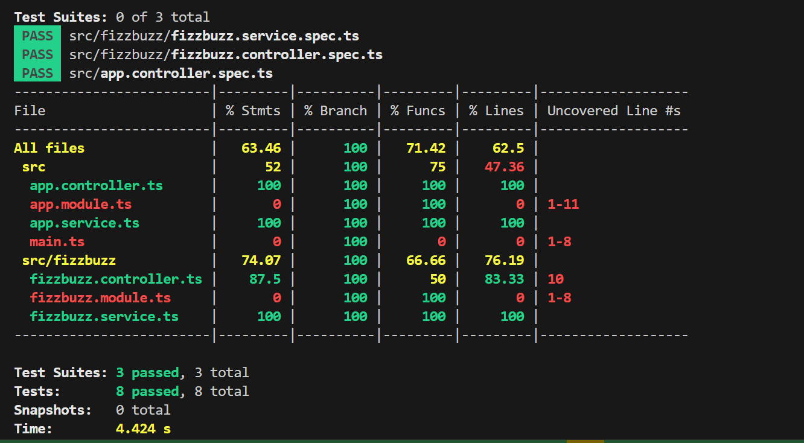

Como resultado también se genera una carpeta coverage/lcov-report con ese mismo informe, pero en HTML. Aparece organizado de acuerdo con los carpetas que tengamos en la carpeta src.

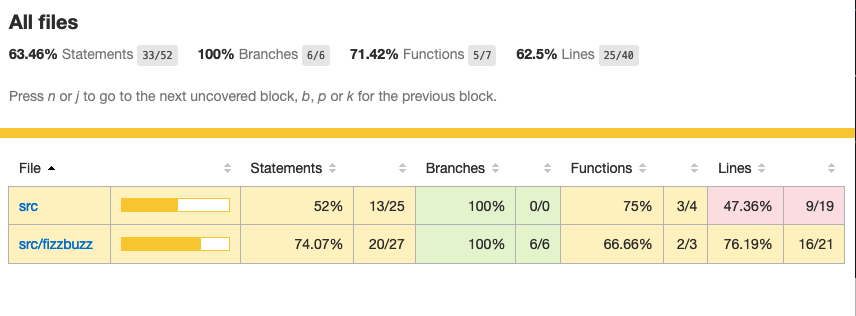

Si hace clic sobre src/fizzbuzz veremos su informe de cobertura. Vemos que está probado el 100% del código del servicio.

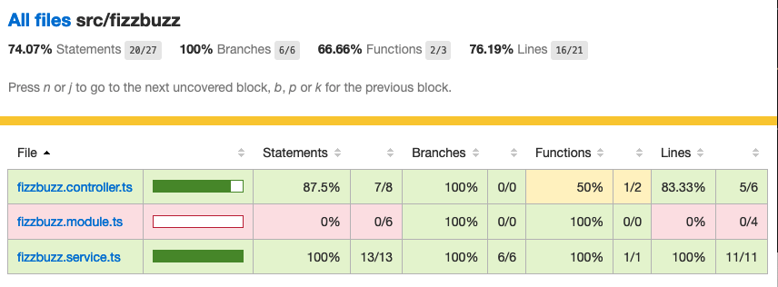

Si ahora modificamos los tests de fizzbuzz/fizzbuzz.service.spec.ts y comentamos uno de ellos, por ejemplo el que probaba los múltiplos de 15, y volvemos a ejecutar la cobertura de tests con npm run test:cov, veremos que la cobertura de fizzbuzz/fizzbuzz.service.ts ha bajado de 100% a 92.3%.


Si ahora hacemos clic sobre fizzbuzz/fizzbuzz.service.ts en el informe, nos llevará al archivo y nos marcará en rojo las líneas de código que no están tratadas (cubiertas) en ningún test. Como hemos comentado anteriormente, este resultado es muy importante porque nos puede guiar en el proceso de priorización de los próximos tests a desarrollar.

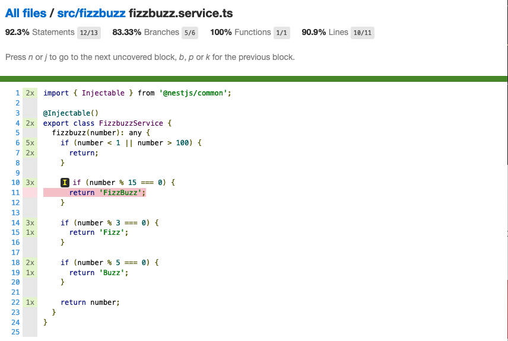

Si anulamos los comentarios del test y volvemos a ejecutar la cobertura de tests todo volverá a estar como antes y ese código ya estará de nuevo cubierto por los tests.

**Hace falta probarlo todo**

En el proceso de testing decidimos qué probar. Alguien podría decir de probarlo todo con una cobertura cercana al 100%. Sin embargo, no es necesario. Sólo hay que probar las partes más críticas. Puede que esté entre el 70%-90%. Normalmente probaremos

Servicios (si hay app.service.ts también)

Controladores (si hay app.controller.ts también)

No hace falta probar DTOs, constantes, entidades y módulos (los podemos excluir de la cobertura ), es lo que veremos en el siguiente apartado

#### 2. 5. 1. [Exclusión de archivos de la cobertura de tests](#temario-📌)

El porcentaje de cobertura de tests que devuelve el informe se obtiene teniendo en cuenta todos los archivos de código del proyecto. Sin embargo, es posible ignorar o excluir archivos del proceso de obtención de la cobertura. Esto se realiza indicando nombres de archivo o indicando un patrón en el elemento coveragePathIgnorePatterns del elemento jest en el archivo package.json.

Por ejemplo, si decidimos excluir del proceso de análisis de cobertura de tests los archivos de los módulos (p.e. app.module.ts, fizzbuzz.module.ts y otros módulos), así quedaría el elemento jest en package.json para excluir los archivos de módulo:

```json
// package.json
"jest": {
    "moduleFileExtensions": [
      "js",
      "json",
      "ts"
    ],
    "rootDir": "src",
    "testRegex": ".*\\.spec\\.ts$",
    "transform": {
      "^.+\\.(t|j)s$": "ts-jest"
    },
    "collectCoverageFrom": [
      "**/*.(t|j)s"
    ],
    "coverageDirectory": "../coverage",
    // esta parte la añadimos
    "coveragePathIgnorePatterns": [".module.ts"],
    "testEnvironment": "node"
  }
```

Ignorar del proceso de cobertura los archivos cuyo nombre termine en .module.ts
Esto mejoraría el porcentaje de cobertura ya que se han retirado los archivos de módulo del proceso de cómputo de la cobertura, ya que bajaban la cobertura porque no tenían tests asociados. La figura siguiente ilustra la cobertura total. Se ha pasado de un 63.46% a un 84.61%. Esto en sí no es ni bueno ni malo, ni un objetivo en sí mismo. Es sólo estar informado que hay ciertos archivos que aceptamos no probar y que de no ser excluidos pueden estar datos erróneos de cobertura.

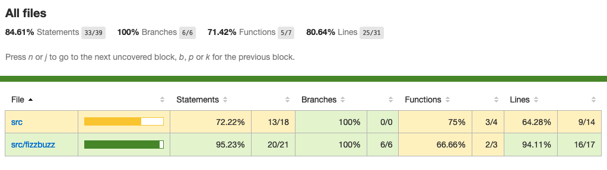

> NOTA: En [Anexo I. Plugin Coverage Gutters](#anexo-i-plugin-coverage-gutters) se presenta un plugin interesante para VSCode que permite monitorizar la cobertura de tests de cada archivo mientras se desarrolla.

### 2.6. [Pruebas unitarias del controlador](#temario-📌)

La cobertura de tests realizada en el apartado anterior nos ha servido para determinar el grado de código que tenemos testado. Hemos visto que tenemos tests para el servicio que prueban el 100% del código de sus métodos. Sin embargo, si vemos la cobertura del controlador, vemos que el código del endpoint (método fizzbuzz) aún está sin probar, tal y como muestra la figura siguiente.

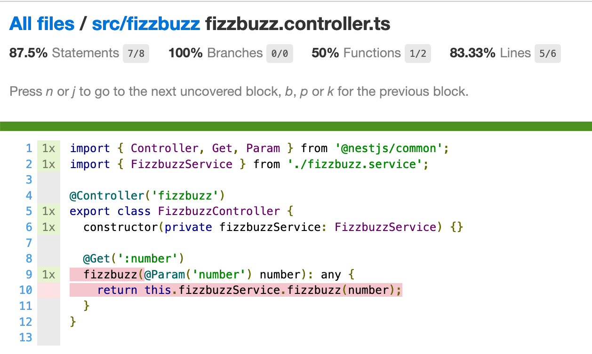

Esto nos sugiere que debemos introducir más tests unitarios en el controlador. Para ello, y como las pruebas unitarias han de ser eso, unitarias, y ejecutarse de forma aislada, la prueba del controlador no deberá apoyarse en el método ya implementado en su servicio. Esto nos lleva a la introducción de la técnica de mocking para el desarrollo de pruebas unitarias. Aquí veremos cómo mockear el servicio de Fizz Buzz para que la prueba del controlador sea independiente.

La técnica de mocking en un controlador básicamente va a consistir en dar una nueva implementación (el mock) de los servicios que usa, y usar dicha nueva implementación o mock para probar el controlador. Esto lo podemos llevar a cabo de dos formas: mockeando un método concreto del servicio mediante jest.spyOn o mockeando el servicio completo.

#### 2. 6. 1. [Mockeo mediante jest.spyOn](#temario-📌)

`jest.spyOn` nos permite crear una nueva implementación (mock) sobre un método existente de un objeto. Seguiremos este patrón

```typescript
  jest.spyOn(<<objeto>>, '<<metodo-existente>>')
    .mockImplementation(<<nueva-implementacion>>);
```

De esta forma, cada vez que se llame en el test al método mockeado, el método se ejecutará con la nueva implementación proporcionada en mockImplementation.

A continuación mockearemos para la prueba del controlador el método fizzbuzz del servicio de forma que devuelva siempre Fizz.

```typescript
import { Test, TestingModule } from '@nestjs/testing'
import { FizzbuzzController } from './fizzbuzz.controller'
import { FizzbuzzService } from './fizzbuzz.service'

describe('FizzbuzzController', () => {
  let controller: FizzbuzzController
  let service: FizzbuzzService

  beforeEach(async () => {
    const module: TestingModule = await Test.createTestingModule({
      controllers: [FizzbuzzController],
      providers: [FizzbuzzService], // 1
    }).compile()

    controller = module.get<FizzbuzzController>(FizzbuzzController)
    service = module.get<FizzbuzzService>(FizzbuzzService) // 2
  })

  it('should return the correct Fizz Buzz word according the introduced number (Using spyOn)', () => {
    // 3
    const result = 'Fizz' // 4

    jest.spyOn(service, 'fizzbuzz').mockImplementation(() => result) // 5

    expect(controller.fizzbuzz(3)).toBe(result) // 6
  })

  it('should be defined', () => {
    expect(controller).toBeDefined()
  })
})
```

- 1 Incorporación del servicio para poder usarlo desde el controlador
- 2 Creación de un objeto para el servicio
- 3 Declaración del test
- 4 Configuración del valor que esperamos
- 5 Mockear el método fizzbuzz del servicio creado para que siempre devuelva lo configurado en result
- 6 Ejecutar el método fizzbuzz del controlador y comprobar que el resultado es correcto

Como el método fizzbuzz ahora está mockeado en el test, la implementación que se usará es la propocionada. En este caso, siempre devuelve lo que hemos configurado en result (Fizz para este ejemplo).

A continuación se muestra el resultado de pasar los tests al controlador con npm run test:watch y pasándole `fizzbuzz.co` como patrón de archivo.

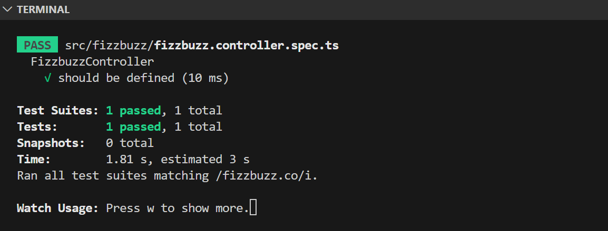

Test del `fizzbuzz.controller.ts` pasado con éxito.

#### 2. 6. 2. [Mockeado del servicio completo](#temario-📌)

Otra alternativa al mockeado de un método concreto de un servicio es el mockeado del servicio completo. Se trata entonces de mockear todos los métodos del servicio. Podremos hacerlo mockeando el servicio en la misma clase en la que se va a usar, o bien, mockearlo en una clase aparte, lo que permitirá su reutilización. Yo lo he realizado en una clase aparte llamada: `fizzbuzz.controler.service-mocked.spec.ts`

La forma de proceder se podría resumir así:

Crear un objeto para el mock del servicio y que dicho objeto contenga la nueva implementación de cada uno de sus métodos. El mockeo se realizará mediante un objeto JSON formado por pares método-valor devuelto.

Sustituir el servicio en la definición del módulo del test (normalmente en el Test.createTestingModule dentro del beforeEach) por el servicio mockeado.

Veamos cómo hacerlo.

```typescript
import { Test, TestingModule } from '@nestjs/testing'
import { FizzbuzzController } from './fizzbuzz.controller'
import { FizzbuzzService } from './fizzbuzz.service'

describe('FizzbuzzController', () => {
  let controller: FizzbuzzController
  let service: FizzbuzzService

  const mockedFizzBuzzValue = 'Buzz' // 1
  const mockFizzBuzzService = {
    // 2
    fizzbuzz: () => mockedFizzBuzzValue, // 3
  }

  beforeEach(async () => {
    const module: TestingModule = await Test.createTestingModule({
      controllers: [FizzbuzzController],
      providers: [FizzbuzzService],
    })
      .overrideProvider(FizzbuzzService) // 4
      .useValue(mockFizzBuzzService) // 5
      .compile()

    controller = module.get<FizzbuzzController>(FizzbuzzController)
    service = module.get<FizzbuzzService>(FizzbuzzService)
  })

  it('should return the correct Fizz Buzz word according the introduced number (Using spyOn)', () => {
    const result = 'Fizz'

    const fizzbuzzSpy = jest.spyOn(service, 'fizzbuzz')
    fizzbuzzSpy.mockImplementation(() => result)

    expect(controller.fizzbuzz(3)).toBe(result)

    fizzbuzzSpy.mockRestore()
  })

  it('should return the correct Fizz Buzz word according the introduced number (Using mocking de servicios)', () => {
    // 6
    expect(controller.fizzbuzz(5)).toBe(mockedFizzBuzzValue) // 7
  })

  it('should be defined', () => {
    expect(controller).toBeDefined()
  })
})
```

- 1 Configuración del valor devuelto por el servicio mockeado
- 2 Objeto que va a representar al servicio mockeado
- 3 Mock del método fizzbuzz y su respuesta mockeada. Es un par método-valor devuelto
- 4 Servicio a mockear
- 5 Reemplazar el servicio por el objeto que tiene el mock del servicio
- 6 Definición del caso de prueba
- 7 Lanzar el método fizzbuzz del controlador y comprobar que devuelve el valor mockeado.

Al igual que antes, cuando el controlador llama a su método fizzbuzz, éste llama al método del servicio, pero el controlador no sabe que el método está mockeado. Un engaño en toda regla.

Por tanto, con esta implementación, cada vez que se llame al método fizzbuzz éste devolverá la respuesta mockeada (Buzz) en este caso. Con esto habremos comprobado el funcionamiento del controlador en sí y de forma independiente del servicio. Sólo hacemos la prueba con un valor del servicio puesto que la validez del servicio con distintos valores cae en el ámbito de las pruebas unitarias del servicio, no en las del controlador.

> NOTA: En nuestro caso no vamos a notar la diferencia entre el mockeo con jest.spyOn y el mockeo del servicio completo porque el servicio de Fizz Buzz cuenta sólo con un método. En servicios con más métodos, el mockeo del servicio completo exige mockear todos los métodos, mientras que el mockeo con `jest.spyOn\_ permite ser mñás finos y mockear un sólo método y dejar el resto del servicio inalterado.

Al pasar de nuevo los tests con wacth pattern: fizzbuzz.co observa

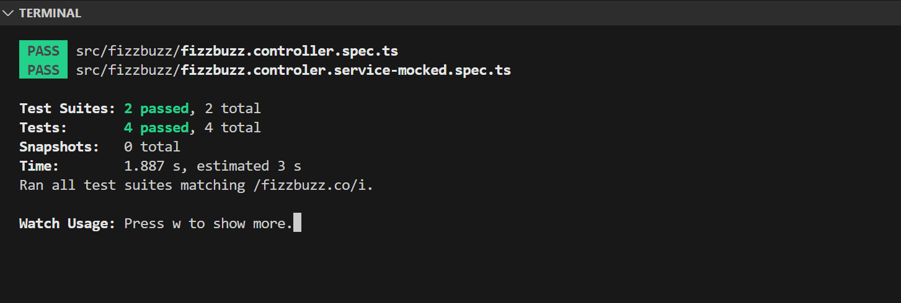

El test con jest.spyOn sigue funcionando porque recordemos que él tiene su propia implementación del mock del método, independientemente de que se haya mockeado el servicio por completo.

Para finalizar, si ahora volvemos a hacer la cobertura de tests, el controlador ya aparece testado y la cobertura habrá subido. Las figuras siguientes lo ilustran.

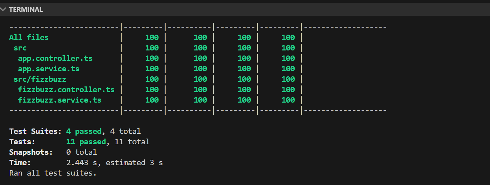

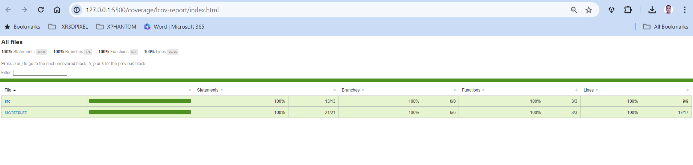

### 2. 7. [Pruebas de integración](#temario-📌)

En las pruebas unitarias comprobamos que partes pequeñas y aisladas del software funcionan según lo esperado. Se encargan de probar unidades sin dependencias o bien mockeando las dependencias para llevar a cabo los tests.

Sin embargo, las pruebas de integración verifican que varias unidades funcionan correctamente de forma conjunta (p.e. controladores con servicios). Las pruebas de integración prueban su comportamiento de forma conjunta y tratan de reducir al máximo el uso de mocks.

Veamos el caso de prueba de integración que genera el CLI de NestJS al crear el proyecto (tests/app.e2e-spec.ts).

```typescript
// /test/app.e2e-spec.ts
import { Test, TestingModule } from '@nestjs/testing'
import { INestApplication } from '@nestjs/common'
import * as request from 'supertest'
import { AppModule } from './../src/app.module'

describe('AppController (e2e)', () => {
  // 1
  //
  let app: INestApplication

  beforeEach(async () => {
    // 2
    const moduleFixture: TestingModule = await Test.createTestingModule({
      imports: [AppModule],
    }).compile()

    app = moduleFixture.createNestApplication()
    await app.init()
  })

  it('/ (GET)', () => {
    // 3
    return request(app.getHttpServer()) // 4
      .get('/') // 5
      .expect(200) // 6
      .expect('Hello World!') // 7
  })
})
```

- 1 Bloque de tests
- 2 Función de preparación del entorno de cada test creando de nuevo la aplicación
- 3 Test de un endpoint
- 4 Realización de llamada a la API
- 5 Ir a la ruta indicada
- 6 Código de estado HTTP esperado
- 7 Valor esperado

Ejecutamos este tipo de tests con:

```bash
npm run test:e2e
# pasará los tests y devoverá lo siguiente
PASS  test/app.e2e-spec.ts
  AppController (e2e)
    ✓ / (GET) (94 ms)

Test Suites: 1 passed, 1 total
Tests:       1 passed, 1 total
Snapshots:   0 total
Time:        1.116 s, estimated 2 s
Ran all test suites
```

Este test ha atacado directamente a la API a través del controlador de Fizz Buzz. Este ha usado el servicio y ha devuelto la respuesta a la petición realizada. Es decir, han intervenido tanto la aplicación, como el controlador de Fizz Buzz, como su servicio. Por eso es que recibe el nombre de prueba de integración, porque combina/integra a varias partes de la aplicación en un solo test.

> NOTA: NestJS usa Supertest para simular las llamadas HTTP.

En el archivo tests/jest-e2e.json se definen las opciones de Jest para las pruebas de integración.

```json
{
  "moduleFileExtensions": ["js", "json", "ts"],
  "rootDir": ".",
  "testEnvironment": "node",
  "testRegex": ".e2e-spec.ts$",
  "transform": {
    "^.+\\.(t|j)s$": "ts-jest"
  }
}
```

testRegex define una expresión regular para indicar los archivos que se considerarán sujetos a las pruebas de integración.

Una vez visto el ejemplo de base, veamos cómo hacer las pruebas del endpoint de la API de Fizz Buzz. Con esto automatizaremos la prueba de cada endpoint de la API. Para probarlo sobre Fizz Buzz, lo haremos creando un archivo test/fizzbuzz.e2e-spec.ts para los tests de integración de llamada al endpoint con los diferentes valores. Crearemos este archivo copiándolo desde test/app.e2e-spec.ts introduciendo los cambios siguientes:

-- test/app.e2e-spec.ts --

```typescript
import { Test, TestingModule } from '@nestjs/testing'
import { INestApplication } from '@nestjs/common'
import * as request from 'supertest'
import { AppModule } from '../src/app.module'

describe('FizzBuzz (e2e)', () => {
  // 1
  let app: INestApplication

  beforeEach(async () => {
    const moduleFixture: TestingModule = await Test.createTestingModule({
      imports: [AppModule],
    }).compile()

    app = moduleFixture.createNestApplication()
    await app.init()
  })

  it('/fizzbuzz/3 (GET) should return Fizz', () => {
    // 2
    return request(app.getHttpServer()) // 3
      .get('/fizzbuzz/3') // 4
      .expect(200) // 5
      .expect('Fizz') // 6
  })
})
```

- 1 Cambiamos la descripción del bloque describe
- 2 Caso de prueba de llamada al endpoint
- 3 Creación de un objeto HTTP para hacer las peticiones
- 4 Acceso a la ruta del endpoint
- 5 Código de estado HTTP esperado
- 6 Respuesta esperada

> NOTA: Si tuviéramos más endpoints crearíamos más funciones it, una para cada endpoint.

Si ahora volvemos a pasar los tests con npm run test:e2e vemos que se pasan las pruebas de app y de fizzbuzz, pero el resultado se muestra agregado y no incluye el resultado de cada uno de los casos de prueba

```bash
$ npm run test:e2e

> fizzbuzz@0.0.1 test:e2e
> jest --config ./test/jest-e2e.json

 PASS  test/app.e2e-spec.ts
 PASS  test/fizzbuzz.e2e-spec.ts

Test Suites: 2 passed, 2 total
Tests:       3 passed, 3 total
Snapshots:   0 total
Time:        2.349 s, estimated 3 s
Ran all test suites.
```

i queremos ver el resultado de cada uno de los casos de prueba dentro de cada suite, haremos el cambio siguiente sobre la configuración de Jest en el archivo package.json incluyendo la opción de --verbose en los tests de integración.

```json
"scripts": {
    ...
    "test:e2e": "jest --config ./test/jest-e2e.json --verbose"
  },
```

Ahora mostrará esto

```bash
$ npm run test:e2e

> fizzbuzz@0.0.1 test:e2e
> jest --config ./test/jest-e2e.json --verbose

# test de integración de fizzbuzz
 PASS  test/fizzbuzz.e2e-spec.ts
  FizzBuzz (e2e)
    √ /fizzbuzz/3 (GET) should return Fizz (178 ms)

# test de integración de app
 PASS  test/app.e2e-spec.ts
  AppController (e2e)
    √ / (GET) (170 ms)

Test Suites: 2 passed, 2 total
Tests:       2 passed, 2 total
Snapshots:   0 total
Time:        2.237 s
Ran all test suites.
```

// HASTA AQUÍ LA PRIMERA PARTE BASADA EN EL EJEMPLO 01: `fizzbuzz`

📁

```textplain
E:\____02 ZONA DE APRENDIZAJE-INVESTIGACION____\03 CURSOS BOOTCAMPS\03 BOOTCAMP 3 EXPERT BACKEND DEVELOPER JS\03 Curso de NestJs\02 examples\fizzbuzz
```

## 3. [Caso de uso. Reserva de espacios](#temario-📌)

// INFORMATION a partir de aquí nos basaremos en otro ejemplo más desarrollado: `reserva-espacios`

📁

```textplain
E:\____02 ZONA DE APRENDIZAJE-INVESTIGACION____\03 CURSOS BOOTCAMPS\03 BOOTCAMP 3 EXPERT BACKEND DEVELOPER JS\03 Curso de NestJs\02 examples\nestjs-espacios
```

### 3. 1. [Primeros tests](#temario-📌)

### 3. 2. [Tests del controlador de solicitudes](#temario-📌)

#### 3. 2. 1. [Primer paso. Evitar que falle el test](#temario-📌)

#### 3. 2. 2. [Segundo paso. Añadir tests](#temario-📌)

#### 3. 2. 3. [Tercer paso. Llevar el mock del servicio a una clase](#temario-📌)

### 3. 3. [Tests del servicio](#temario-📌)

#### 3. 3. 1. [Primer paso. Evitar que falle el test](#temario-📌)

#### 3. 3. 2. [Segundo paso. Añadir tests](#temario-📌)

#### 3. 3. 3. [Tercer paso. Llevar el mock del repositorio a una clase](#temario-📌)

### 3. 4. [Tests end to end](#temario-📌)

#### 3. 4. 1. [Añadir script para tests e2e en modo watch](#temario-📌)

#### 3. 4. 2. [Primer paso. Evitar que falle el test](#temario-📌)

#### 3. 4. 3. [Segundo paso. Añadir tests](#temario-📌)

#### 3. 4. 4. [Tercer paso. Llevar el mock del repositorio a una clase](#temario-📌)

### 3. 5. [Cobertura de tests](#temario-📌)

### 3. 6. [Creación del resto de tests](#temario-📌)

## [Anexo I. Plugin Coverage Gutters](#temario-📌)

```

```

```

```

```

```
